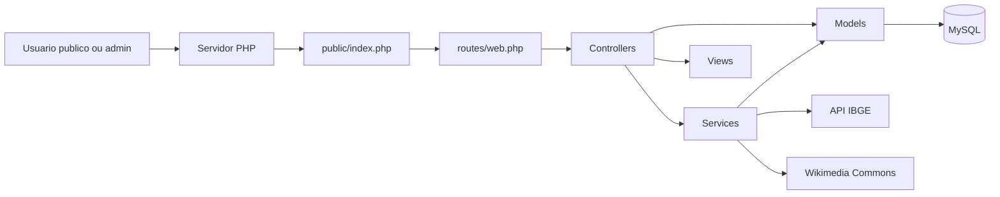

# Arquitetura da Solucao

## Visao geral

O MAPI CONECTA foi estruturado como um sistema MVC em PHP com separacao entre area publica, area autenticada e painel administrativo. A persistencia fica em MySQL e as integracoes externas enriquecem a base municipal.

## Componentes principais

- `public/index.php`
  Front controller da aplicacao.
- `routes/web.php`
  Define as rotas publicas e administrativas.
- `app/Core`
  Kernel da aplicacao, roteamento, request, response, sessao, auth e view.
- `app/Controllers`
  Orquestram requisicoes e respostas.
- `app/Models`
  Encapsulam acesso a dados.
- `app/Services`
  Regras de negocio e integracoes, como IBGE e Wikimedia.
- `app/Views`
  Templates da area publica e do admin.
- `database/schema.sql`
  Estrutura inicial do banco e seeds do MVP.

## Apoio de IA no processo

Durante o desenvolvimento, a equipe utilizou apoio de tecnologia de inteligencia artificial para acelerar tarefas tecnicas, revisar estrutura, apoiar refinamentos de interface e organizar partes da documentacao. Esse uso ocorreu como ferramenta assistiva, sem substituir a definicao funcional, a validacao tecnica e a responsabilidade final da equipe sobre o sistema.

## Diagrama de arquitetura

## Fluxo principal

1. O usuario acessa a aplicacao pela web.
2. O front controller inicializa ambiente, autoload, timezone e sessao.
3. O roteador identifica a rota e envia para o controller correto.
4. O controller executa validacoes, auth e regras de negocio.
5. Quando necessario, services consomem APIs externas e organizam a logica.
6. Models persistem ou consultam dados no MySQL.
7. A resposta final e renderizada pelas views.

## Modulos do MVP

- Municipios e estados
- Curadoria editorial
- Turismo e pontos de interesse
- Midias municipais
- Quizzes e ranking
- Mapa publico
- Educacao
- QR Codes administrativos

## Integracoes externas

### IBGE

Usado para:

- importar estados e municipios
- enriquecer dados factuais municipais

### Wikimedia Commons

Usado para:

- importar imagens e simbolos municipais
- preencher galeria de midias e imagem principal

## Regras de operacao importantes

- conteudo editorial e importado pode passar por curadoria
- importacoes amplas podem ser publicadas imediatamente conforme a estrategia operacional atual
- o banco ja suporta expansao para outros estados, embora o foco do MVP esteja no Piaui

## Observacao para submissao academica

Este documento atende ao item de diagrama de arquitetura exigido para Ensino Superior e pode ser referenciado diretamente no README do repositorio.
